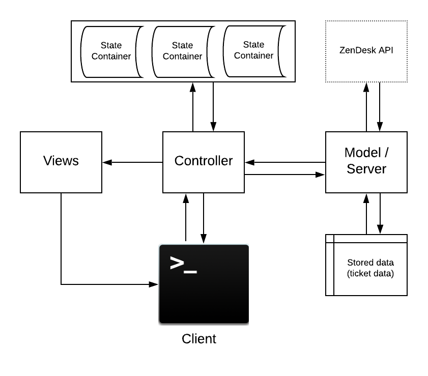

# Zendesk CLi Ticket Viewer
# Introduction
Zendesk CLi is a lightweight & highly performant viewer client that shows all tickets that an agent has in their account. In addition, it has the ability to show pertinent details of a single ticket. The application interfaces with ZenDesk’s tickets API as the ‘source of truth’ to provide the associated tickets for the viewer to process and show. 

# Contents:
- <a href="#installation">Installation</a>
- <a href="#execution">Execution</a>
- <a href="#running-spec-tests">Running Spec Tests</a>
- <a href="#requirement-checklist">Requirement checklist</a>
- <a href="#choosing-cli">Choosing CLi</a>
- <a href="#architecture">Architecture</a>
- <a href="#process">Process</a>
  - <a href="#api-requests">API Requests</a>
  - <a href="#pagination-methods">Pagination methods (Scalability)</a>
  - <a href="#testing">Testing</a>
  - <a href="#challenges">Challenges</a>
- <a href="#future-updates">Future updates</a>


# Installation
This application has been tested to run on MacOS X/UNIX based machines. However, due to the cross platform nature of Ruby (as it is an interpreted language), the application may work on other operating systems. 

Due to the nature of dependencies and file systems between operating systems, <b>it is strongly recommended that you run Zendesk CLi on MacOS based systems</b>. 

## Prerequisites:
 - Ruby 2.5.1 or over

To check what version of Ruby you have installed, in the terminal, enter:

```
ruby -v
```
If you do not have Ruby installed:
```
brew install ruby
```

For further information, please refer to the installation guides of Ruby:
- <a href="https://www.ruby-lang.org/en/documentation/installation" target="_blank">Installation Guide</a>

Afterwards, `git clone` the repository into your preferred directory. 

This application is designed to run with minimal dependencies for portability. The dependencies are as follows:
- HTTP
- JSON
- Formatador
- Pry (for debugging only)

The rubygems HTTP & JSON should be preinstalled with most installations of Ruby. To check whether they exist:
```
gem list | grep -E "http|json"
```
If either only one or none appear, please install these gems:
```
gem install http
```
```
gem install json
```
Afterwards, install:
```
gem install formatador
```

# Execution

To run the program, please navigate to the git cloned repository in your terminal application. Once inside the root folder, enter:

```
ruby controller/application_controller.rb
```

Violia!

# Running Spec Tests
To run spec tests, please follow the steps below:

- Step 1. Ensure that you are in the root working directory of the project
- Step 2. Open up controller/application_controller.rb
- Step 3. <b>Remove or comment the last line `ApplicationController.run_main`</b>
- Step 4. In the terminal, run:
```
rspec tests/application_spec.rb
```
The tests should run

# Requirement Checklist

Meets requirements:
- No extra features are added. => Check
- All required features have been attempted. => Check
- Displays some knowledge of application design:
  - Separation of concerns. => Check
  - Simplicity. => Check
- Handles basic errors:
  - Displays a friendly error message if the API is unavailable or the response is invalid. => Check
- Tells the user something is wrong if there is a program error. => Check

- Includes tests.
- UI is easy to use and displays ticket results clearly. => Check
- Code demonstrates:
  - Consistency. => Used Robocop, check
  - Adherence to common standards. => Used Robocop, check


# Choosing CLi

I opted to build the application entirely in the command line as I have a deep affinity towards to the backend side of software development. I enjoy the elegance of well constructed systems and building an application through the command line allows to show the intracacies of software architecture. In addition, as I'm currently studying at a bootcamp that primarily uses Ruby, I decided to further hone down on my ruby skills. 

Due to the elegant simplicity of the project, I decided to challenge myself by attempting to undertake the project in a BDD (TDD) fashion while using RSpec, a popular testing DSL for Ruby for the first time. This later return to a more unit testing style of development due to a mis-step during coding.


# Architecture
The architecture of any software application or system is crucial and provides the foundation to build off. Poor software architecture often leads to substantial technical debt and the inability to add future features in an agile fashion. 

I considered multiple options, 

- MVP (Model View Presenter)
- MVC (Model View Controller)
- MVC with Passive View
- Event driven Architecture

I eventually chose the Model-View-Controller with Passive View. The architecture diagram is as follows:



The reasoning behind this choice is that the MVC architectural pattern is one of the widely used patterns and provides effective decoupling between the business logic, data retrieval and the presentation of such information to the user. However, the main reason behind the passive view was to further decouple the view from the model to ensure that the view has no ability to mutate to model, which allows for more room for error. 

This does involve additional work as data binding is done at the controller side as the view has minimal logic as possible.

Other patterns like the Event Driven architecture required substantially higher complexity and seemed to over-complicate the project of this size. Therefore, the MVC with passive view remained the clear choice. 

In summary:
- The MVC model allows for effective decoupling of business logic, data and presentation. This ensures that the structure of the program is well organised, there is a clear separation of concerns and testing can done effectively without affecting other functions.

In the Zendesk CLi: 
- Model - handles server requests and the treatment & processing of data. Statefulness through storing responses similar to a database. This is Similar to rails, node or go server.

- Controller - Queries the model and ultimately drives the program from user input. It maintains statefulness through state containers (similar to redux).

- Presentation - Presents the views to the user. Little logic as possible, completely decoupled from the model. Controller feeds in the view to show.

# Process
## API Requests
API requests were handled through a rubygem called 'HTTP' which purports to possess one of the fastest speeds for web requests. Basic auth was utilised and statically written into the model. Although this indeed does raise plenty of security concerns as it is visible in plain text, for the nature of this project using syncronous or asyncronous encryption (or environment variables) would make for an extremely cumbersome experience. Especially since as the credentials aren't highly sensitive (as it is a trial account, billing isn't an issue).

Of course, in production more sophisicated security measures would be taken such as using API tokens with synchronous encryption (through a shared secret key).

## Pagination Methods
Paginating through the entire ticket list was undoubtly the biggest component of this project. There were multiple approaches to tackle this problem:

  - <b>Pure Thin client:</b> The client becomes merely a layer to the server and handles no logic by itself. Although this is indeed efficient as it removes any risk of failure at processing-time on the client side, it does open up to quite a bit of latency. This means that the client needs to maintain a connection (not persistent, rather the client <em>needs</em> to stay online to request any new pages). Although many users may not paginate entirely through the entire ticket list, the latency can add up when paginating through 2-4 pages which can significantly detract from the User Experience. Each request is at constant O(1) time. 

 -  <b>Pure Fat client:</b> The client now handles all of the parsing, processing, storing for <b><em>all</b></em> tickets involved. In essence, the client becomes a mini version of the ZenDesk API. This does not require a connection to the internet when in pagination mode. However, this indeed can lead to processing errors and most importantly, storage. This method will clearly <b>not scale</b>, as it requires the client to download the <em>entire</em> ticket list which could be in the order of 10s of thousands. Initial request is at O(1) time but processing is at O(n) time.

- <b>Progressive client:</b> I chose this method to for my pagination. It combines the best of both worlds, the thick and thin client-server architectures. Instead of requesting the entire dataset which cost both bandwidth and time, only the first small n tickets are downloaded, processed and displayed. Only when the client requests the  page, the next set of data is prefetched (preferrably asyncronously in the background) and then displayed when l+2 is requested, then it displayed.

The time complexity of my pagination function is O(n) = T(2n) for processing, unlike pure fat client, the retrieval time should always be constant O(1) as you are only retrieving a constant number of tickets. For small n, this approach provides <b>blazing fast</b> pagination, allows the client to be temporarily disconnected (mobile friendly) and the pagination not to be interrupted.

Thus, for the purposes of this project, I do believe the progressive client is highly scalable due to small file of the JSON involved (always under 1-2MB). However, to conclude, the pure thin client is the most ideal model when the data size (size complexity) becomes large. This is due to the asymptotic time complexity of  of my processing in pagination (new pages need to be inserted to the master array). 


## Testing 
I wanted to thoroughly challenge myself by attempting RSpec and TDD for the first time in my as a bootcamp development student. I spent most of my time experimenting with RSpec, reading documentation, going through syntaxes, understanding how RSpec deals with mocks, spies and assertions. 

However, due to the infinite recusive nature of my application (i.e. all of my menus which require continuous input from the user) it become extremely difficult to know what to use and thus become stuck in writing my tests which did not truly reflect my code.

Due to the time constraint and a development challenge, I reverted back to standard unit tests. However, it was a great learning experience nonetheless!

## Challenges

I did face quite a number of challenges as I want to push myself
- Using RSpec
- Implemeting the dynamic, progressive client
- Developing under TDD
- Researching gems for fast quering to an API

I did face a serious architectural misjudgement on Sunday where I implemented a method that was in an infinite loop and due to the main menu being an infinite loop, the application would not accept input of any kind.

Thus, I reverted back to previous git commit, re-thought how to better implement methods that require continuous user input while also maintaining statefulness. The answer, component wide state containers (class variables in ruby), storing the state and then only mutating it once the function has run, a textbook case for recursive methods.


# Future updates
- Refactor pagination method, instead of using page_limit arrays, use `[start..finish]` using much more dynamic state fashion. This improves processing to O(1).

- Better testing, simulating user input and mocks. This is was a very new field (the RSpec DSL) so creating a better framework for testing would be a definite improvement.
